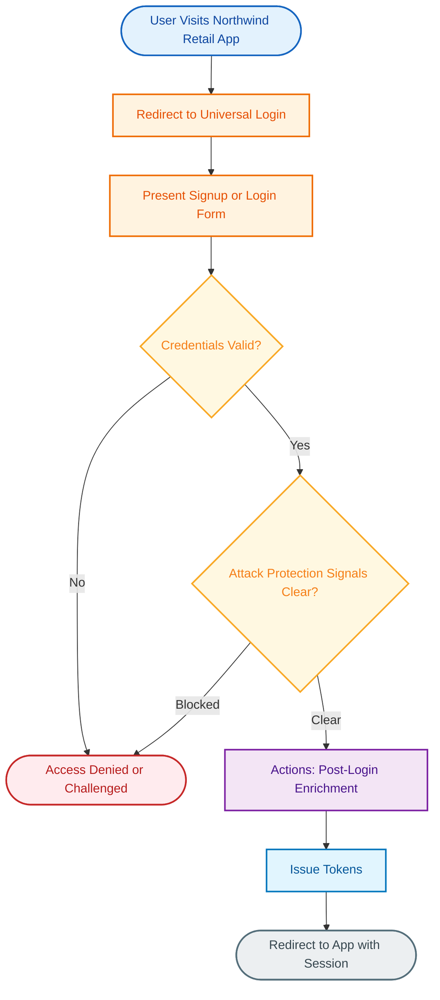
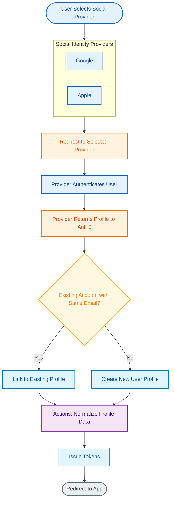
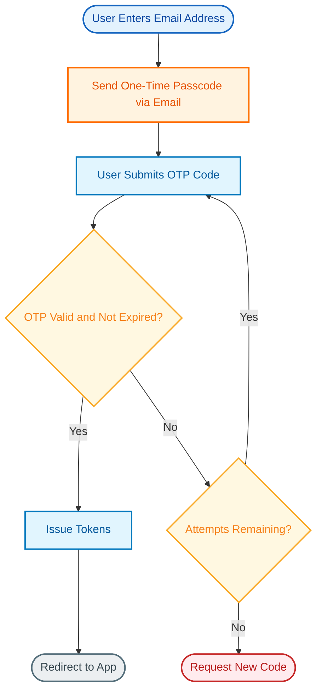
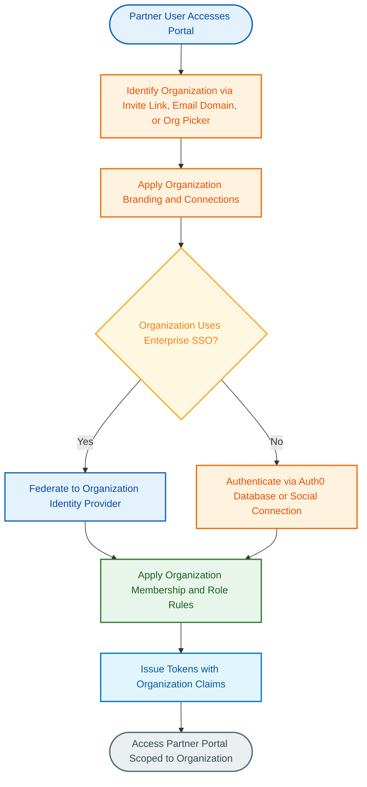
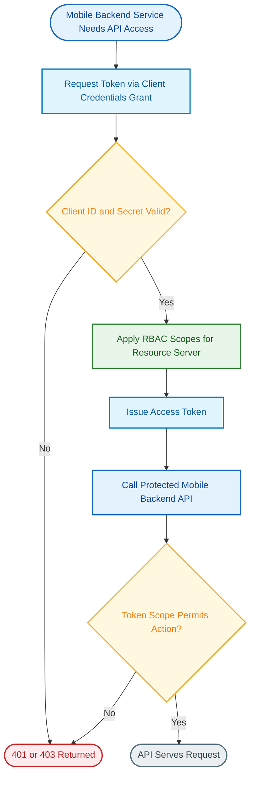
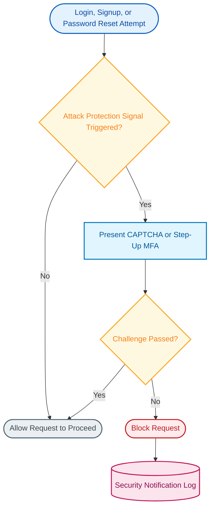

# Okta Customer Identity Cloud (Powered by Auth0): Northwind Retail Use Case Implementation Guide

**Customer:** Northwind Retail
**Platform:** Okta Customer Identity Cloud (CIC), powered by Auth0
**Date:** 2026-07-15

---

## Executive Summary

Northwind Retail is implementing Okta Customer Identity Cloud (CIC), powered by Auth0, to unify consumer authentication, business-partner access, and mobile backend API security under a single identity platform. This guide covers **six use cases** spanning the full customer identity lifecycle: consumer signup and login through Universal Login, social login via Google and Apple, passwordless email OTP authentication, a B2B partner portal built on Auth0 Organizations, machine-to-machine (M2M) API access for the mobile backend, and Attack Protection with bot mitigation.

Across these use cases, three platform capabilities do the heavy lifting: **Universal Login** as the single hosted authentication surface for every channel (web, mobile, partner portal), **Actions** as the extensibility model for custom business logic at each stage of the auth pipeline, and **Attack Protection** as the always-on layer of automated threat mitigation. Organizations extends the same tenant to serve Northwind's B2B wholesale partners without standing up separate tenants per partner, and Machine-to-Machine applications secure the mobile backend's service-to-service API calls using the OAuth2 Client Credentials grant.

This guide documents the honest state of each capability, including one item Northwind should track regardless of which use cases are in scope for this engagement: Auth0's legacy Rules and Hooks extensibility models reach end-of-life on **November 18, 2026** and are already in read-only mode — any existing Northwind Auth0 usage should be audited for this dependency before it becomes a hard blocker.

Each section below documents the relevant use case(s), the platform mechanics, the components involved, and a set of discovery questions to validate directly with Northwind's technical stakeholders before implementation begins.

---

## Section 1: Consumer Signup & Login (Universal Login)

**Use Cases Covered:**
- UC1: Consumer Signup & Login (Universal Login)

### Overview

Northwind Retail's direct-to-consumer storefront needs a single, consistent signup and login experience across web and mobile without every application team building and maintaining its own authentication UI. Universal Login is Auth0's centrally hosted authentication surface: rather than embedding a login form inside each application, Northwind's apps redirect to a login page served and maintained by Auth0, branded to look like Northwind's own site. This removes an entire class of security surface area (credential-handling code, CSRF protection, password-reset flows) from every individual application team's scope.

Under the hood, Universal Login is backed by a Database Connection that stores and validates Northwind's consumer credentials (or federates to an external store, if Northwind already has one). At the point of authentication, Actions — Auth0's current extensibility model — run custom business logic such as adding custom claims to the issued token, enforcing Northwind-specific password or profile requirements, or calling an external loyalty-program API to enrich the user's profile before the token is issued. Attack Protection evaluates the request in the same pipeline, so credential-stuffing and bot traffic are screened before a session is ever created.

This approach is materially better than a hand-rolled login form: Universal Login's current experience is a lighter-weight, centrally maintained implementation that supports MFA, WebAuthn/passkeys, localization, and Organizations out of the box, and it is updated by Auth0 as new authentication methods and security patches are released — Northwind's engineering team does not carry that maintenance burden.

> **Note on legacy extensibility:** Actions is the only extensibility model recommended for new logic. Auth0's older Rules and Hooks models are closed to new edits and are scheduled to stop executing entirely on **November 18, 2026**. If Northwind has any pre-existing Auth0 tenant activity (e.g., a pilot, a dev tenant, or a prior implementation), it should be audited for Rules/Hooks dependencies now rather than discovered later as a migration fire drill.

### How It Works

The flow starts the moment a Northwind customer hits any app that requires authentication. The app redirects to Universal Login rather than rendering its own form. After the Database Connection validates credentials, the request passes through Attack Protection's signal evaluation before any Action logic runs — a failed credential check or a blocked Attack Protection signal both terminate the flow at "Access Denied or Challenged" rather than issuing a token. Only after both checks clear does the post-login Action run (for example, adding a `loyalty_tier` custom claim) and a token get issued back to the app.

### Key Features

| Feature | Purpose |
|---------|---------|
| Universal Login (new experience) | Centrally hosted, brandable login/signup/password-reset surface shared across all Northwind apps — removes custom auth UI from every app team's scope and inherits new authentication methods (passkeys, WebAuthn) automatically |
| Database Connection | Stores and validates Northwind consumer credentials directly in Auth0, or federates against an existing user store if one already exists |
| Actions (post-login trigger) | Custom Node.js logic executed after credential validation — used for custom claims, loyalty-profile enrichment, or conditional step-up logic |
| Attack Protection (in-line) | Automated bot/credential-stuffing/breach screening evaluated as part of the same login pipeline, before a session is created |
| Branding & Custom Domains | Applies Northwind's logo, colors, and custom domain (e.g., `login.northwindretail.com`) to the hosted login page |

### Discovery Items

- [ ] Will Auth0 be the system of record for consumer credentials, or does an existing Northwind user store (e.g., a legacy CRM or commerce platform) need to be imported or federated?
- [ ] What custom profile attributes (loyalty tier, marketing consent, preferred store location, etc.) must be captured at signup or added via post-login Actions?
- [ ] What password policy and email/phone verification requirements does Northwind's compliance or brand team require?
- [ ] Does any existing Northwind Auth0 tenant activity currently rely on legacy Rules or Hooks that will need an Actions migration plan before November 18, 2026?
- [ ] What Attack Protection thresholds are appropriate for Northwind's expected traffic (holiday sales spikes in particular), to avoid false-positive blocks of legitimate shoppers?

---

## Section 2: Social Login (Google and Apple)

**Use Cases Covered:**
- UC2: Social Login (Google and Apple)

### Overview

Requiring every Northwind shopper to create and remember a new password is friction that measurably reduces signup completion. Social Login lets customers authenticate with an identity they already have — a Google account or an Apple ID — instead of creating Northwind-specific credentials. Auth0 handles the OAuth/OIDC handshake with each provider as a pre-built Social Connection, so Northwind's engineering team configures the provider (client ID, secret, requested scopes) once in the Auth0 Dashboard rather than implementing each provider's protocol directly.

The distinct challenge with social login is identity resolution: a customer who signs up with Google today and returns tomorrow via Apple (using the same email address) should not end up with two disconnected Northwind accounts. Auth0 resolves the new profile against existing accounts and, depending on Northwind's chosen policy, either automatically links the identities or prompts the customer to confirm the link. An Actions trigger normalizes the profile data returned by each provider — Google and Apple return different profile shapes — into Northwind's consistent internal user-profile format before the token is issued.

Both Google and Apple require real developer-account setup work outside of Auth0 itself: a Google Cloud project (free tier is sufficient) and, for Apple, a paid Apple Developer account with a Services ID and a signing key generated specifically for Sign in with Apple. These are prerequisites, not Auth0 configuration steps, and should be scheduled into the project timeline accordingly.

### How It Works

Once the shopper picks a provider, Auth0 redirects to that provider's own login screen — Northwind never sees or handles the customer's Google or Apple password. After the provider authenticates the user and returns a profile, Auth0 checks whether an account with the same email already exists. Both the "link" and "create new" paths converge on the same Actions-based normalization step, so downstream logic (loyalty tier assignment, custom claims) only has to be written once regardless of which path a given login took.

### Key Features

| Feature | Purpose |
|---------|---------|
| Social Connections (Google, Apple) | Pre-built OAuth/OIDC integrations — Northwind configures credentials once per provider rather than implementing each provider's protocol |
| Account Linking | Resolves a returning customer who authenticates via a different provider (or database login) using the same email, avoiding duplicate accounts |
| Actions (profile normalization) | Normalizes the different profile shapes Google and Apple return into Northwind's consistent internal user-profile format |
| Universal Login | Presents all enabled social providers alongside database login on the same hosted page |
| Branding & Custom Domains | Keeps the social-provider redirect experience consistent with Northwind's branded login page |

### Discovery Items

- [ ] Does Northwind already have (or need to create) a Google Cloud project and an Apple Developer account with a Services ID and signing key for Sign in with Apple?
- [ ] How should account linking behave when a customer signs up via Google after previously registering with a database (email/password) connection using the same email — automatic link, or a confirmation prompt?
- [ ] What profile fields are needed from each provider (name, email, profile photo), and do the consent/scope screens need Northwind-specific customization?
- [ ] Is Apple's business/App Store review process for Sign in with Apple already accounted for in the project timeline, given it is a prerequisite outside Auth0's control?
- [ ] Are there other social providers (Facebook, etc.) Northwind wants to reserve for a future phase, and should the account-linking design anticipate them now?

---

## Section 3: Passwordless Email OTP Authentication

**Use Cases Covered:**
- UC3: Passwordless Email OTP Authentication

### Overview

For segments of Northwind's customer base — occasional shoppers, gift-purchase flows, or customers who simply do not want to manage another password — passwordless authentication removes the password entirely. With Auth0's Passwordless Connection configured for email, the customer enters only their email address; Auth0 sends a one-time passcode (OTP), and entering the correct code authenticates the user. No password is ever created, stored, or reset.

By default, Auth0 issues each OTP with a three-minute validity window, and only the most recently issued code is valid at any time — requesting a new code invalidates any prior one. The customer gets three attempts to enter the correct code before they must request a new one; this bounds brute-force guessing without requiring a separate CAPTCHA step for this flow. On first successful OTP entry, Auth0 creates the user's profile on the email connection automatically — there is no separate "signup" step distinct from the first login.

Passwordless is well suited to Northwind's lower-friction use cases, but it is not a drop-in replacement for every flow: Auth0's own built-in email delivery is intended for testing only and does not support template customization, so a production rollout needs a real transactional email provider configured, and Northwind should decide up front whether passwordless coexists with password-based login or replaces it for specific customer segments.

### How It Works

The loop between "Submit" and "Attempts" reflects the built-in retry allowance: a wrong code returns the customer to code entry (not a full restart) as long as attempts remain. Only after three failed attempts does the flow force the customer back to requesting an entirely new code, which also invalidates whatever code was previously issued.

### Key Features

| Feature | Purpose |
|---------|---------|
| Passwordless Connection (Email OTP) | Sends a one-time passcode to the customer's email in place of password-based login; no password is ever created |
| Automatic profile creation | Creates the user's profile on first successful OTP entry — no separate signup step |
| Built-in OTP expiry and retry limits | Default 3-minute code validity and 3 failed-attempt allowance bound the exposure window without a separate CAPTCHA step |
| Actions (fallback / step-up logic) | Can add fallback logic (e.g., SMS retry) or step-up requirements for higher-risk actions after passwordless login |
| Universal Login | Presents the passwordless email flow alongside other configured login methods on the same hosted page |

### Discovery Items

- [ ] Should passwordless email OTP coexist with password-based login as a customer choice, or fully replace passwords for specific segments (e.g., gift-order guest checkout)?
- [ ] What production transactional email provider will send the OTP messages, since Auth0's built-in email provider is for testing only and does not support template customization?
- [ ] What is the expected email deliverability/spam-filtering risk for Northwind's customer base, and what fallback exists if a customer does not receive the code?
- [ ] Does Northwind want the default 3-minute OTP validity window and 3-attempt limit, or does a different risk tolerance require adjusting these (and, if extended, increasing OTP length accordingly)?

---

## Section 4: B2B Partner Portal with Organizations

**Use Cases Covered:**
- UC4: B2B Partner Portal with Organizations

### Overview

Alongside its consumer storefront, Northwind Retail operates a wholesale partner portal used by independent retailers who resell Northwind products. Each partner is a distinct business with its own set of users, and Northwind needs each partner to see only their own order history, pricing, and inventory data — while Northwind's engineering team maintains one portal codebase and one Auth0 tenant, not a forest of per-partner deployments.

Auth0 Organizations is purpose-built for exactly this pattern: it models each wholesale partner as an Organization within a single Auth0 tenant, each with its own membership, branding, and (optionally) its own enterprise connection. A partner with its own corporate identity provider can federate directly — its employees log in with their own corporate credentials rather than a Northwind-issued password — while smaller partners without their own IdP can use Auth0-hosted database or social login instead. In both cases, the resulting token carries organization membership and role claims that the partner portal application uses to scope every subsequent API call to that partner's data.

This is a materially lighter-weight approach than provisioning a separate Auth0 tenant per wholesale partner, which is a heavier isolation boundary typically reserved for full environment separation (dev/staging/prod) or hard regulatory data-residency requirements — not for every individual business customer. Organizations gives Northwind that isolation at the application level without the operational overhead of managing dozens or hundreds of tenants.

### How It Works

Organization identification happens before authentication method is even chosen, since it determines which branding and connections apply. From there the flow branches only on whether that specific partner has its own enterprise IdP — both branches converge on the same organization-membership and role-application step, so the partner portal's authorization logic is written once against a consistent token shape regardless of how a given partner's users authenticated.

### Key Features

| Feature | Purpose |
|---------|---------|
| Organizations | Models each wholesale partner as an isolated container (membership, branding, connections) within Northwind's single Auth0 tenant |
| Organization-specific branding | Lets each partner see a login experience that can be tailored to their relationship with Northwind, without a separate tenant |
| Enterprise Connections (per Organization) | Allows partners with their own corporate IdP to federate directly; smaller partners use Auth0-hosted login instead |
| RBAC (Roles & Permissions) | Bundles partner-portal permissions into roles assigned per Organization membership, carried in the token as claims |
| Management API | Automates Organization creation, membership assignment, and connection configuration as Northwind onboards new partners |

### Discovery Items

- [ ] How will individual partner users be mapped to their Organization — invitation link, email-domain matching, or manual admin assignment?
- [ ] Which wholesale partners require federation to their own enterprise identity provider (SAML/OIDC/Azure AD), versus using Auth0-hosted login?
- [ ] Does each partner Organization need distinct branding, or is a shared "Northwind Wholesale" branding experience acceptable across all partners?
- [ ] How many partner Organizations are expected at launch and over the following year, and does the onboarding process need to be self-service or admin-driven?
- [ ] Can an individual user belong to more than one partner Organization simultaneously (e.g., a distributor representing multiple retail brands), and if so, how does the portal handle organization switching?

---

## Section 5: Machine-to-Machine API Access for the Mobile Backend

**Use Cases Covered:**
- UC5: Machine-to-Machine API Access for the mobile backend

### Overview

Northwind's mobile app backend needs to call internal services — inventory lookups, order processing, loyalty-points calculation — where the caller is a backend service, not an end user with a browser session. Auth0 handles this with Machine-to-Machine (M2M) Applications using the OAuth2 Client Credentials grant: a backend service authenticates directly with its own client ID and secret (no user, no redirect, no login form) and receives an access token scoped to exactly the permissions that service needs.

Each M2M application is registered against a specific API (a "resource server" in Auth0 terms), and RBAC on that resource server defines the available permissions. This is the same RBAC model used for user-facing APIs, applied to service identities instead of human ones — a mobile-backend order-processing service can be granted `read:inventory` and `write:orders` without also getting permissions a different internal service needs. If that same backend later needs to call Auth0's own Management API (for example, to automate customer account operations), that requires its own dedicated M2M application with its own scoped permissions — it is not implicitly covered by the mobile backend's existing M2M credentials.

This pattern keeps service-to-service authorization declarative and auditable: adding a new internal service that the mobile backend needs to call is a matter of registering a new M2M application and granting it the specific scopes required, rather than sharing a single all-purpose credential across every backend service Northwind operates.

### How It Works

Token issuance and API authorization are two separate checkpoints. Auth0 validates the client credentials and issues a scoped token in one step; the API itself (external to Auth0, running in Northwind's own backend infrastructure) is responsible for checking that the token's scope actually permits the specific action being requested. A valid token does not guarantee every action succeeds — an M2M app granted only `read:inventory` presenting a valid token still gets rejected if it attempts `write:orders`.

### Key Features

| Feature | Purpose |
|---------|---------|
| Machine-to-Machine Applications | Registers each backend service as its own identity with its own client ID/secret, separate from end-user identities |
| Client Credentials Grant | OAuth2 flow purpose-built for service-to-service calls with no end user present |
| RBAC on Resource Servers | Scopes each M2M application to only the permissions that specific service needs (least privilege) |
| Management API (separate M2M scope) | Allows automated tenant administration, but only via its own dedicated M2M application — not implicitly granted to other M2M apps |
| Token expiry / rotation | Bounds the blast radius of a leaked service credential or token |

### Discovery Items

- [ ] Which specific internal services does the mobile backend need to call, and what is the least-privilege scope set for each (rather than one broad "mobile-backend" scope)?
- [ ] How will M2M client secrets be stored and rotated — is there an existing secrets manager (e.g., AWS Secrets Manager, HashiCorp Vault) this should integrate with?
- [ ] Does the mobile backend (or any other Northwind service) need to call the Auth0 Management API directly, which would require a separate, dedicated M2M application?
- [ ] What token lifetime and expected call-volume/rate-limit requirements apply to the mobile backend's M2M traffic, particularly during peak shopping periods?

---

## Section 6: Attack Protection & Bot Mitigation

**Use Cases Covered:**
- UC6: Attack Protection & Bot Mitigation

### Overview

Northwind's consumer-facing login, signup, and password-reset endpoints are a standing target for credential-stuffing bots, scripted account-creation abuse, and reuse of credentials leaked in unrelated third-party breaches. Attack Protection is Auth0's built-in, always-on layer addressing this without requiring Northwind to integrate a separate bot-mitigation or fraud vendor for baseline coverage.

Attack Protection combines four distinct signals: Bot Detection (identifies automated traffic using statistical models, IP reputation, and traffic-pattern analysis, and can trigger a CAPTCHA step), Suspicious IP Throttling (blocks an IP address that rapidly attempts many logins or signups across multiple accounts), Brute-Force Protection (detects repeated failed login attempts against a single account), and Breached Password Detection (checks credentials against Auth0's records of publicly disclosed breaches and can force a password reset before allowing access). These signals run as part of the same authentication pipeline used for every use case in this guide — they are not a separate system Northwind has to wire in per application.

Because these protections are evaluated automatically, the primary configuration work for Northwind is tuning: setting thresholds appropriate to Northwind's actual traffic patterns (a holiday sale driving a burst of legitimate signups should not be mistaken for a bot attack), and deciding what additional custom response logic — via Actions — is needed beyond Auth0's default block/challenge behavior, such as custom customer notifications or integration with Northwind's own fraud-monitoring tooling.

### How It Works

Not every triggered signal results in an outright block — Bot Detection in particular is designed to first present a CAPTCHA challenge rather than block immediately, giving a legitimate user (who happens to trip a heuristic) a path to proceed. Only a failed challenge, or a signal type that Northwind has configured to block outright (such as a confirmed breached-password match), results in the request being blocked and a security notification logged.

### Key Features

| Feature | Purpose |
|---------|---------|
| Bot Detection | Identifies automated login/signup traffic via statistical models, IP reputation, and traffic-pattern analysis; can trigger a CAPTCHA rather than an outright block |
| Suspicious IP Throttling | Blocks an IP address rapidly attempting logins or signups across multiple accounts |
| Brute-Force Protection | Detects and blocks repeated failed login attempts targeting a single account |
| Breached Password Detection | Checks credentials against publicly disclosed breach data and can force a password reset before allowing access |
| Actions (custom response logic) | Extends default block/challenge behavior with Northwind-specific notifications or fraud-tooling integration |

### Discovery Items

- [ ] What is Northwind's acceptable user-friction tolerance (CAPTCHA prompts, temporary blocks) versus risk tolerance, particularly during high-traffic events like seasonal sales?
- [ ] Does Northwind need custom blocking or notification logic beyond Auth0's default Attack Protection thresholds, implemented via Actions?
- [ ] Are there known legitimate high-volume traffic patterns (e.g., corporate bulk ordering from a single office IP) that could trigger false positives and require allowlisting?
- [ ] What customer-facing notification is expected when brute-force or breached-password protection triggers on their account (email, in-app message, support escalation)?
- [ ] Does Northwind require log streaming of Attack Protection events to an external SIEM for fraud/security team visibility beyond Auth0's tenant-scoped logs?

---

## Appendix A: Use Case to Section Mapping

| Use Case | Name | Section |
|----------|------|---------|
| UC1 | Consumer Signup & Login (Universal Login) | Section 1: Consumer Signup & Login (Universal Login) |
| UC2 | Social Login (Google and Apple) | Section 2: Social Login (Google and Apple) |
| UC3 | Passwordless Email OTP Authentication | Section 3: Passwordless Email OTP Authentication |
| UC4 | B2B Partner Portal with Organizations | Section 4: B2B Partner Portal with Organizations |
| UC5 | Machine-to-Machine API Access for the mobile backend | Section 5: Machine-to-Machine API Access for the Mobile Backend |
| UC6 | Attack Protection & Bot Mitigation | Section 6: Attack Protection & Bot Mitigation |

## Appendix B: Key Components Used

| Component | Purpose | Sections Used |
|-----------|---------|---------------|
| Universal Login | Centrally hosted, brandable authentication surface (login, signup, password reset) shared across all apps | 1, 2, 3, 4 |
| Database Connection | Stores and validates Northwind consumer credentials | 1, 2 |
| Social Connections (Google, Apple) | Pre-built OAuth/OIDC federation to Google and Apple identity | 2 |
| Passwordless Connection (Email OTP) | Sends and validates one-time passcodes in place of passwords | 3 |
| Organizations | Models each B2B wholesale partner as an isolated container within one tenant | 4 |
| Enterprise Connections | Federates partner-specific corporate identity providers (SAML/OIDC/Azure AD) | 4 |
| Machine-to-Machine Applications | Service identities using the OAuth2 Client Credentials grant | 5 |
| RBAC (Roles & Permissions) | Scopes API/token permissions by role for both partner-portal users and M2M services | 4, 5 |
| Actions | Custom Node.js logic at defined pipeline trigger points (post-login, M2M token issuance, etc.) | 1, 2, 3, 6 |
| Attack Protection | Bot Detection, Brute-Force Protection, Breached Password Detection, Suspicious IP Throttling | 1, 6 |
| Branding & Custom Domains | Applies Northwind (and per-partner) branding and custom domains to Universal Login | 1, 2, 4 |
| Management API | Automates tenant configuration — Organization/partner onboarding, M2M app registration | 4, 5 |

## Appendix C: Discovery Items Summary

**Section 1: Consumer Signup & Login (Universal Login)**
- [ ] Will Auth0 be the system of record for consumer credentials, or does an existing Northwind user store need to be imported or federated?
- [ ] What custom profile attributes must be captured at signup or added via post-login Actions?
- [ ] What password policy and email/phone verification requirements does Northwind's compliance or brand team require?
- [ ] Does any existing Northwind Auth0 tenant activity currently rely on legacy Rules or Hooks that will need an Actions migration plan before November 18, 2026?
- [ ] What Attack Protection thresholds are appropriate for Northwind's expected traffic (holiday sales spikes in particular)?

**Section 2: Social Login (Google and Apple)**
- [ ] Does Northwind already have (or need to create) a Google Cloud project and an Apple Developer account with a Services ID and signing key?
- [ ] How should account linking behave when a customer signs up via Google after previously registering with a database connection using the same email?
- [ ] What profile fields are needed from each provider, and do consent/scope screens need Northwind-specific customization?
- [ ] Is Apple's business/App Store review process for Sign in with Apple already accounted for in the project timeline?
- [ ] Are there other social providers Northwind wants to reserve for a future phase?

**Section 3: Passwordless Email OTP Authentication**
- [ ] Should passwordless email OTP coexist with password-based login, or fully replace passwords for specific segments?
- [ ] What production transactional email provider will send OTP messages, since Auth0's built-in email provider is for testing only?
- [ ] What is the expected email deliverability/spam-filtering risk, and what fallback exists if a customer does not receive the code?
- [ ] Does Northwind want the default 3-minute OTP validity window and 3-attempt limit, or does a different risk tolerance require adjusting these?

**Section 4: B2B Partner Portal with Organizations**
- [ ] How will individual partner users be mapped to their Organization — invitation link, email-domain matching, or manual admin assignment?
- [ ] Which wholesale partners require federation to their own enterprise identity provider, versus Auth0-hosted login?
- [ ] Does each partner Organization need distinct branding, or is shared branding acceptable?
- [ ] How many partner Organizations are expected at launch and over the following year, and should onboarding be self-service or admin-driven?
- [ ] Can an individual user belong to more than one partner Organization simultaneously?

**Section 5: Machine-to-Machine API Access for the Mobile Backend**
- [ ] Which specific internal services does the mobile backend need to call, and what is the least-privilege scope set for each?
- [ ] How will M2M client secrets be stored and rotated?
- [ ] Does the mobile backend (or any other Northwind service) need to call the Auth0 Management API directly, requiring a separate dedicated M2M application?
- [ ] What token lifetime and rate-limit requirements apply to the mobile backend's M2M traffic during peak periods?

**Section 6: Attack Protection & Bot Mitigation**
- [ ] What is Northwind's acceptable user-friction tolerance versus risk tolerance, particularly during seasonal sales events?
- [ ] Does Northwind need custom blocking or notification logic beyond Auth0's default Attack Protection thresholds?
- [ ] Are there known legitimate high-volume traffic patterns that could trigger false positives and require allowlisting?
- [ ] What customer-facing notification is expected when brute-force or breached-password protection triggers?
- [ ] Does Northwind require log streaming of Attack Protection events to an external SIEM?
</content>
