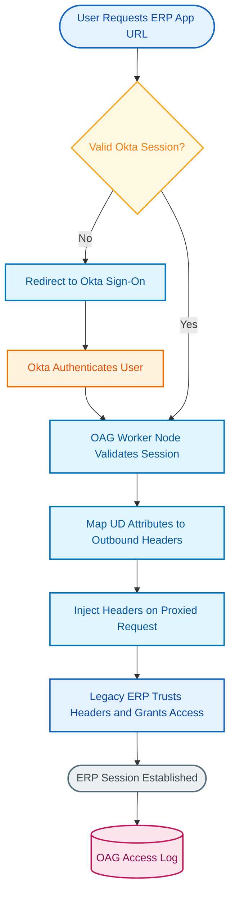
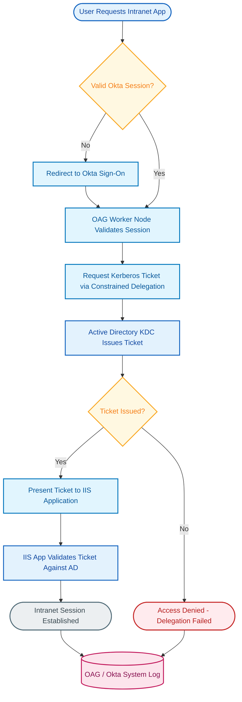
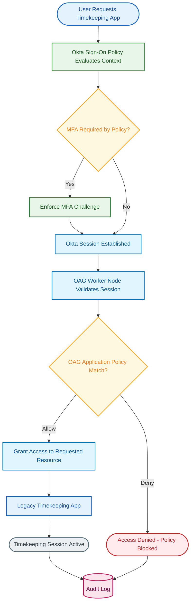
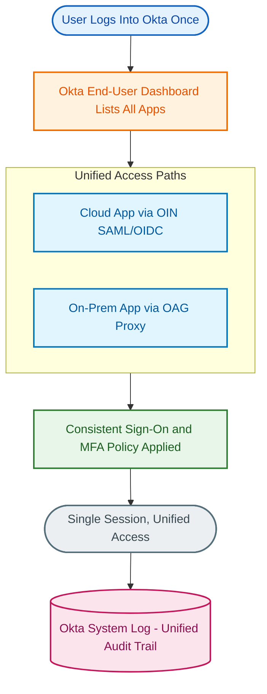

# Okta Access Gateway: Atlas Manufacturing Use Case Implementation Guide

**Customer:** Atlas Manufacturing
**Platform:** Okta Access Gateway (OAG)
**Date:** 2026-07-15

## Executive Summary

Atlas Manufacturing operates a mix of legacy on-premises applications — a header-authenticated ERP system, an IIS-hosted intranet application relying on Windows Integrated Authentication, and a single-factor legacy timekeeping system — alongside a growing portfolio of modern cloud applications, all of which need to sit behind one consistent Okta sign-in experience. This guide covers 4 use cases, organized into 4 sections that map directly to those use cases: header-based single sign-on for the legacy ERP, Kerberos/Integrated Windows Authentication (IWA) SSO for the intranet application, modern MFA enforcement in front of the legacy timekeeping application, and unified hybrid access spanning on-premises and cloud applications under a single Okta identity provider.

Okta Access Gateway is the right-fit product for the three on-premises use cases because each involves a legacy application that cannot natively speak SAML or OIDC. OAG is a self-hosted reverse-proxy virtual appliance — not a SaaS service — so this guide is deliberately explicit about the infrastructure and operational ownership that come with it (worker-node clusters, load balancing, patching, and capacity planning) rather than presenting OAG as a drop-in cloud feature. The hybrid access use case is the connective layer: it does not introduce new OAG mechanics but establishes that OAG-fronted legacy apps and natively-federated cloud apps share the same Okta session, sign-on policy, and audit trail.

Every section below documents assumptions that must be validated with Atlas Manufacturing before implementation, including application header/attribute contracts, Active Directory delegation readiness, MFA trigger conditions, and — most importantly — the long-term roadmap for retiring or modernizing the legacy applications OAG is bridging today. Okta positions Access Gateway as a migration bridge, not a permanent target-state architecture, and this guide treats that positioning as a planning input rather than a caveat to gloss over.

---

## Section 1: Header-Based SSO for the Legacy ERP Application

**Use Cases Covered:**
- UC1: Header-Based SSO to a legacy on-prem ERP web app (Atlas Manufacturing Corporate Network)

### Overview

Atlas Manufacturing's legacy ERP system was built for a header-based/WAM-style authentication model: it trusts identity and role information passed to it as HTTP headers rather than validating a SAML assertion or OIDC token itself. This is a common pattern for applications originally deployed behind SiteMinder, IIS-based WAM, or similar reverse-proxy authentication layers, and it means the ERP cannot be onboarded as a standard Okta Integration Network (OIN) app. Okta Access Gateway solves this by sitting in front of the ERP as a reverse proxy: it terminates the user's browser session, validates the Okta-authenticated session, and injects the appropriate identity attributes as HTTP headers on the request it forwards to the ERP's backend.

This approach lets Atlas Manufacturing apply the same Okta sign-on policy, MFA requirements, and centralized deprovisioning to the ERP that it already applies to its modern SaaS applications — without touching a line of the ERP's own code. The mapping between Universal Directory attributes and the specific header names/formats the ERP expects is configured once, centrally, in the OAG Admin Node, and enforced consistently by every worker node in the cluster.

Compared to the manual process this typically replaces — a standalone WAM or SiteMinder deployment maintained separately from the Okta org, with its own policy engine and its own audit trail — consolidating under OAG means a single place to manage authentication policy, a single session lifecycle, and a single System Log to audit access to the ERP alongside every other app in the Okta tenant.

### How It Works

If the user does not already have a valid Okta session, they are redirected through Okta sign-on (including any MFA required by policy) before ever reaching the OAG worker node. Once a valid session exists, the OAG worker node — not the ERP itself — is the component that validates it and performs the attribute-to-header mapping. The ERP never sees Okta directly; it only sees a request arriving with the headers it already expects, which is what allows this integration to work without ERP code changes.

### Key Features

| Feature | Purpose |
|---------|---------|
| Header-Based SSO (Generic Header app) | Configures OAG to inject identity attributes as HTTP headers matching the ERP's existing WAM-style trust model |
| Attribute/Claim Mapping | Maps Universal Directory fields (username, email, roles, entitlements) to the specific header names/formats the ERP expects |
| Application Policies (Protected / Protected Rule) | Restricts ERP access by group or attribute match, and can require a valid session before any resource under the app is reachable |
| OAG Worker Node Cluster | Handles all live proxy traffic and header injection at scale; sized using Okta's published capacity tiers (PoC/Small/Medium/Large) based on ERP user count |
| Universal Directory (UD) | Source of truth for the attributes mapped into outbound headers |

### Discovery Items

- [ ] Does the ERP currently trust upstream headers from an existing WAM/SiteMinder deployment today, and if so, what are the exact header names and formats it expects?
- [ ] Which UD attributes (username, email, role, entitlement) map to each required header, and is that mapping documented anywhere today or does it need to be reverse-engineered from the current WAM config?
- [ ] Does the ERP validate the session on every request, or does it rely on its own cookie-based session after the first authenticated hit — and does that change how aggressively OAG needs to re-validate?
- [ ] Can OAG worker nodes reach the ERP's backend network path (firewall rules, VLAN/subnet routing, DNS resolution) from wherever the OAG cluster is deployed?
- [ ] Is there an existing WAM/SiteMinder system being retired as part of this project, and what is the cutover sequencing and rollback plan?

---

## Section 2: Kerberos / Integrated Windows Authentication SSO for the Intranet Application

**Use Cases Covered:**
- UC2: Kerberos / Integrated Windows Auth SSO to an intranet app (Atlas Manufacturing Corporate Network)

### Overview

Atlas Manufacturing's intranet application is hosted on IIS and authenticates users today via Integrated Windows Authentication (IWA) — the browser silently presents a Kerberos ticket, and the app validates it against Active Directory. This works natively for domain-joined machines on the internal network, but it does not extend to remote users or give Okta any visibility into or control over that access. Okta Access Gateway bridges this by performing Kerberos constrained delegation on the user's behalf: after validating the user's Okta session, OAG requests a Kerberos ticket from Active Directory's KDC using a dedicated delegation-enabled service account, then presents that ticket to the IIS application exactly as the user's own browser would have.

This lets remote and on-network users alike authenticate through Okta first — with Okta's MFA and sign-on policy enforced — and then be transparently handed off to the AD-integrated application without prompting for Windows credentials a second time. It replaces "the app only works if you're on the corporate network with a domain-joined machine" with "the app works anywhere Okta can authenticate the user," while keeping the application's own AD-based authorization model untouched.

The tradeoff Atlas Manufacturing needs to plan for up front is scope: Okta's own documentation states that Access Gateway's Kerberos constrained delegation only supports connecting to the default site on an IIS server, and that additional IIS sites require a custom solution built by Okta Professional Services. If the intranet application is the only IWA app on that IIS server, this is a non-issue — but it must be confirmed before design, not discovered during cutover.

### How It Works

The critical handoff in this flow is the Kerberos ticket request: OAG does not simply forward the user's Okta identity as a claim, it actively performs constrained delegation against Active Directory, which means the OAG service account's delegation rights and the KDC's reachability from the OAG cluster are hard dependencies, not configuration nice-to-haves. If ticket issuance fails, the user should see a clear denial rather than a generic proxy error, and that failure should be logged for troubleshooting.

### Key Features

| Feature | Purpose |
|---------|---------|
| Kerberos Constrained Delegation (Microsoft IWA app type) | Lets OAG obtain a Kerberos ticket on the user's behalf and present it to the IIS-hosted intranet app |
| Dedicated AD Service Account + Keytab | Required delegation identity that OAG uses to request tickets from the KDC; must be explicitly granted constrained delegation rights in AD |
| Active Directory / KDC Reachability | The OAG cluster must have a network path to the domain controller(s) servicing the intranet app's domain |
| Application Policies | Governs which users/groups can reach the intranet app before Kerberos delegation is even attempted |
| Default-Site Delegation Scope | Out-of-the-box support covers one app per IIS default site; additional IIS sites require a custom solution from Okta Professional Services |

### Discovery Items

- [ ] Is Active Directory reachable from the planned OAG deployment location, and has a network path (firewall rules, routing) to the relevant domain controller(s) been confirmed?
- [ ] Has a dedicated AD service account been provisioned with constrained delegation rights specifically for OAG, and who owns maintaining its keytab?
- [ ] Is the intranet application the only IWA-based app hosted on this IIS server's default site, or are there other IWA apps that would trigger the documented one-app-per-default-site limitation?
- [ ] What is the intranet app's current authentication behavior for remote/off-network users today — does it already have a fallback, or is remote access currently unsupported?
- [ ] If additional IIS sites/apps are discovered during design, is Atlas Manufacturing prepared to engage Okta Professional Services, or should those apps be rescoped to a different integration pattern?

---

## Section 3: Adding Modern MFA in Front of the Legacy Timekeeping Application

**Use Cases Covered:**
- UC3: Adding MFA in front of a legacy timekeeping app (Atlas Manufacturing Corporate Network)

### Overview

Atlas Manufacturing's legacy timekeeping application currently authenticates with a single factor — typically a local username and password with no MFA capability of its own — which is a common gap for older line-of-business systems that predate modern authentication standards and were never built to integrate with an MFA provider. Because the timekeeping app cannot be modified to call an MFA API directly, the practical way to add MFA in front of it is to require Okta authentication (with MFA enforced by Okta sign-on policy) before OAG will proxy any request through to the backend application.

In this pattern, Okta's sign-on policy — not an OAG-native MFA implementation — is what actually enforces the MFA challenge. OAG's role is to validate that a qualifying Okta session already exists and then apply its own Application Policy (Protected, Protected Rule, Adaptive, or Custom) to control which specific resources within the app are reachable and by whom. This separation matters for design: contextual/adaptive triggers such as network zone or device trust are Okta sign-on policy concepts, and it is not consistently documented whether equivalent conditions can be evaluated natively inside an OAG Application Policy itself — this needs to be validated per environment rather than assumed.

The result for Atlas Manufacturing is that a legacy system with no native security investment gets brought up to the same MFA bar as the rest of the app portfolio, using the identity layer Atlas already has, rather than requiring a costly re-platforming of the timekeeping system itself.

### How It Works

MFA enforcement happens entirely before OAG is involved — it is Okta's sign-on policy, evaluated at login, that decides whether the user must step up. OAG's Application Policy check happens afterward and is a second, independent gate: even a fully-authenticated, MFA-verified user can still be denied access to a specific resource under the timekeeping app if the Application Policy's group or attribute rule does not match.

### Key Features

| Feature | Purpose |
|---------|---------|
| Okta Sign-On Policies | The actual enforcement point for MFA/step-up; evaluated before OAG ever proxies a request |
| OAG Application Policy (Protected Rule) | Restricts access to specific timekeeping app resources using PCRE-based regular expression rule matching against the request path |
| OAG Application Policy (Custom) | Extends Protected Rule to support entering a regular expression as the URI itself, for edge-case resource matching |
| Universal Directory Group Membership | Basis for which users/groups the Protected Rule policy allows or denies |
| OAG / Okta System Log | Captures both the Okta-side MFA challenge outcome and the OAG-side policy decision for audit purposes |

### Discovery Items

- [ ] Does the legacy timekeeping app have any native authentication controls today, or is it fully single-factor/password-only?
- [ ] What conditions should trigger step-up MFA (network zone, device trust, specific user groups), and should that logic live in the Okta org-level sign-on policy or be attempted inside an OAG Application Policy — this needs to be confirmed per environment since native condition support inside OAG policy is not consistently documented?
- [ ] Which user populations should be explicitly allowed vs. explicitly blocked from specific timekeeping app resources under a Protected Rule policy?
- [ ] Is there a need for custom (regex-based URI) policy logic beyond the standard Protected/Protected Rule/Adaptive policy types, and if so, what specific URL patterns need to be matched?
- [ ] What is the current incident/support process if a user is denied by the OAG Application Policy — does the timekeeping app team have visibility into OAG-side denials, or does that require a joint runbook?

---

## Section 4: Hybrid Access — On-Prem and Cloud Under One Okta Identity Provider

**Use Cases Covered:**
- UC4: Hybrid Access (on-prem + cloud) under one Okta IdP (All Domains)

### Overview

Atlas Manufacturing's end goal is not three isolated OAG integrations — it is a single Okta identity layer that spans both the on-premises legacy applications covered in Sections 1–3 and the modern cloud applications already federated through the Okta Integration Network (OIN). From the end user's perspective, the ERP, the intranet app, and the timekeeping app should appear in the same Okta End-User Dashboard as Salesforce, Workday, or any other OIN-integrated SaaS app, protected by the same sign-on policy and the same MFA requirements, with no visible distinction in how access was granted.

Architecturally, this is achieved not by a single new OAG mechanism but by the fact that OAG-fronted apps and OIN-fronted apps both terminate at the same Okta authentication layer. A cloud app authenticates via native SAML/OIDC directly against Okta; an on-prem legacy app authenticates the user against Okta first and then relies on OAG to bridge the resulting session into whatever legacy protocol the app expects. Both paths produce one Okta session, evaluated by one sign-on policy, and logged to one System Log — which is what gives Atlas Manufacturing's security team a single place to review access across its entire application portfolio rather than reconciling two disconnected audit trails.

The discovery work in this section is less about OAG mechanics and more about governance and roadmap: which applications are genuine long-term OAG candidates versus which should be migrated to direct federation as they're modernized, and what operational team owns the OAG appliance infrastructure itself. Okta positions Access Gateway explicitly as a bridge for apps that cannot yet speak modern federation — not as a permanent architecture — so this section should also capture Atlas Manufacturing's intended timeline for retiring or replatforming the apps it fronts.

### How It Works

The diagram intentionally collapses the cloud and on-prem paths into a single grouped step rather than showing them as two separately-terminating branches: regardless of which path a given app takes, the outcome is identical from a governance standpoint — one session, one policy evaluation, one audit entry. That convergence is the actual value proposition of the hybrid access use case, and it is what should be validated with Atlas Manufacturing's security and compliance stakeholders, not just IT operations.

### Key Features

| Feature | Purpose |
|---------|---------|
| Okta as Single Identity Provider | Authenticates the user once and establishes the session that both OIN apps and OAG validate, regardless of app type |
| Okta Integration Network (OIN) | Provides native SAML/OIDC federation for cloud apps that don't need OAG at all |
| Okta Access Gateway | Bridges legacy on-prem apps that cannot speak modern federation into the same session/policy model |
| Consistent Sign-On Policy | Applies the same MFA and contextual access rules across both cloud and on-prem paths |
| Unified Okta System Log | Single audit trail across both OIN-federated and OAG-proxied application access |

### Discovery Items

- [ ] Which of Atlas Manufacturing's on-prem applications are genuine OAG candidates (no SAML/OIDC support) versus which already support modern federation and should bypass OAG entirely?
- [ ] Is OAG intended as a long-term access layer for these three applications, or an interim bridge while they are modernized or retired — and what is the target timeline?
- [ ] Does Atlas Manufacturing operate multiple on-prem sites/networks that would require separate OAG clusters rather than one shared cluster, and how does that affect capacity-tier sizing?
- [ ] What internal team owns ongoing OAG appliance operations (patching, high availability, disaster recovery, monitoring) — is this the infrastructure team, the identity team, or a managed service?
- [ ] Should the OAG cluster and the Okta org be treated as Workforce Identity Cloud only, or does Atlas Manufacturing have any Customer Identity Cloud (Auth0)-fronted use cases that would also need an OAG IdP configuration?

---

## Appendix A: Use Case to Section Mapping

| Use Case | Name | Section |
|----------|------|---------|
| UC1 | Header-Based SSO to a legacy on-prem ERP web app (Atlas Manufacturing Corporate Network) | Section 1: Header-Based SSO for the Legacy ERP Application |
| UC2 | Kerberos / Integrated Windows Auth SSO to an intranet app (Atlas Manufacturing Corporate Network) | Section 2: Kerberos / Integrated Windows Authentication SSO for the Intranet Application |
| UC3 | Adding MFA in front of a legacy timekeeping app (Atlas Manufacturing Corporate Network) | Section 3: Adding Modern MFA in Front of the Legacy Timekeeping Application |
| UC4 | Hybrid Access (on-prem + cloud) under one Okta IdP (All Domains) | Section 4: Hybrid Access — On-Prem and Cloud Under One Okta Identity Provider |

## Appendix B: Key Components Used

| Component | Purpose | Sections Used |
|-----------|---------|----------------|
| Okta Access Gateway (OAG) Admin Node | Central configuration console for apps, policies, and cluster settings | 1, 2, 3, 4 |
| OAG Worker Node Cluster | Handles live proxy traffic, header injection, Kerberos ticket presentation, and policy enforcement at scale | 1, 2, 3, 4 |
| Header-Based SSO (Generic Header app type) | Injects mapped user attributes as HTTP headers for WAM-style legacy apps | 1 |
| Attribute/Claim Mapping | Maps Universal Directory fields to outbound headers | 1 |
| Kerberos Constrained Delegation (Microsoft IWA app type) | Obtains and presents a Kerberos ticket to an IIS-hosted backend app on the user's behalf | 2 |
| Active Directory / KDC | Domain controller used for Kerberos constrained delegation; requires a dedicated service account and keytab | 2 |
| Application Policies (Protected, Protected Rule, Adaptive, Custom) | Per-app / per-resource access rules enforced by OAG after session validation | 1, 2, 3 |
| Okta Sign-On Policies | Enforces authentication and MFA/step-up requirements before a session reaches OAG | 3, 4 |
| Universal Directory (UD) | Source of user attributes and group memberships used across header mapping and policy rules | 1, 2, 3 |
| Okta Integration Network (OIN) | Native SAML/OIDC federation for cloud apps that don't require OAG | 4 |
| Okta (as Identity Provider) | Authenticates the user and establishes the session every downstream component validates | 1, 2, 3, 4 |
| OAG / Okta System Log | Unified audit trail for both OAG-proxied and Okta-native application access | 1, 2, 3, 4 |
| Capacity Tiers (PoC / Small / Medium / Large) | Okta-published sizing guidance for OAG worker-node count and app count per cluster | 1, 4 |
| Load Balancer (customer-provided) | Distributes traffic across OAG worker nodes; requires session affinity for HA | 4 |

## Appendix C: Discovery Items Summary

**Section 1: Header-Based SSO for the Legacy ERP Application**
- [ ] Does the ERP currently trust upstream headers from an existing WAM/SiteMinder deployment today, and if so, what are the exact header names and formats it expects?
- [ ] Which UD attributes (username, email, role, entitlement) map to each required header, and is that mapping documented anywhere today or does it need to be reverse-engineered from the current WAM config?
- [ ] Does the ERP validate the session on every request, or does it rely on its own cookie-based session after the first authenticated hit?
- [ ] Can OAG worker nodes reach the ERP's backend network path (firewall rules, VLAN/subnet routing, DNS resolution)?
- [ ] Is there an existing WAM/SiteMinder system being retired as part of this project, and what is the cutover sequencing and rollback plan?

**Section 2: Kerberos / Integrated Windows Authentication SSO for the Intranet Application**
- [ ] Is Active Directory reachable from the planned OAG deployment location, and has a network path to the relevant domain controller(s) been confirmed?
- [ ] Has a dedicated AD service account been provisioned with constrained delegation rights specifically for OAG, and who owns maintaining its keytab?
- [ ] Is the intranet application the only IWA-based app hosted on this IIS server's default site, or are there other IWA apps that would trigger the documented one-app-per-default-site limitation?
- [ ] What is the intranet app's current authentication behavior for remote/off-network users today?
- [ ] If additional IIS sites/apps are discovered during design, is Atlas Manufacturing prepared to engage Okta Professional Services, or should those apps be rescoped?

**Section 3: Adding Modern MFA in Front of the Legacy Timekeeping Application**
- [ ] Does the legacy timekeeping app have any native authentication controls today, or is it fully single-factor/password-only?
- [ ] What conditions should trigger step-up MFA, and should that logic live in the Okta sign-on policy or an OAG Application Policy?
- [ ] Which user populations should be explicitly allowed vs. explicitly blocked from specific timekeeping app resources?
- [ ] Is there a need for custom regex-based URI policy logic beyond the standard policy types?
- [ ] What is the current incident/support process if a user is denied by the OAG Application Policy?

**Section 4: Hybrid Access — On-Prem and Cloud Under One Okta Identity Provider**
- [ ] Which on-prem applications are genuine OAG candidates versus which already support modern federation?
- [ ] Is OAG intended as a long-term access layer or an interim bridge, and what is the target modernization timeline?
- [ ] Does Atlas Manufacturing operate multiple on-prem sites/networks that would require separate OAG clusters?
- [ ] What internal team owns ongoing OAG appliance operations (patching, HA, DR, monitoring)?
- [ ] Should the OAG IdP configuration account for Customer Identity Cloud (Auth0)-fronted use cases in addition to Workforce Identity Cloud?
