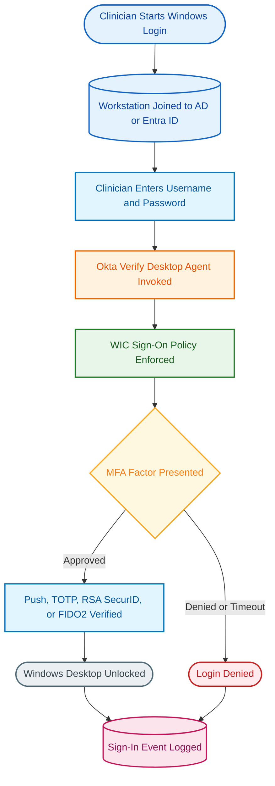
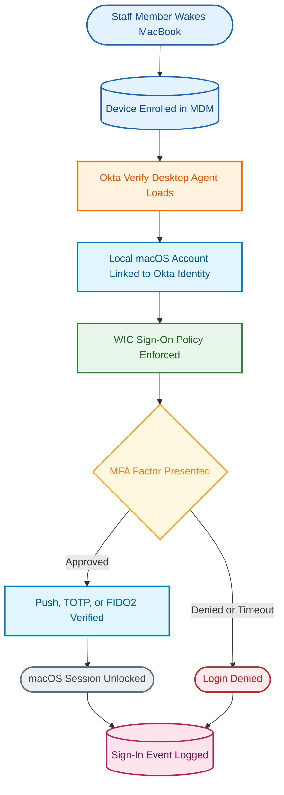
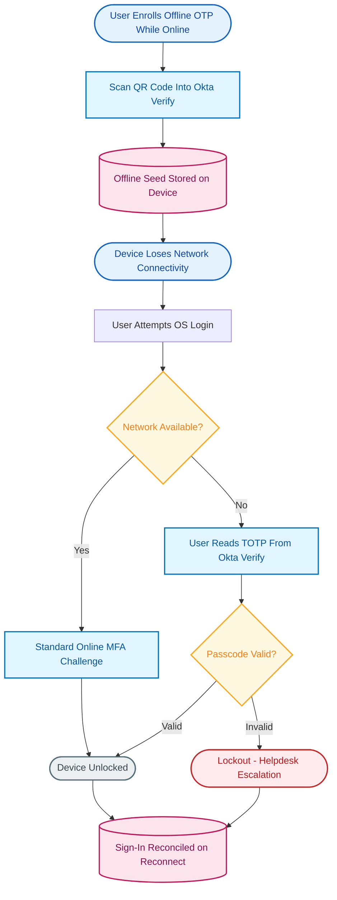
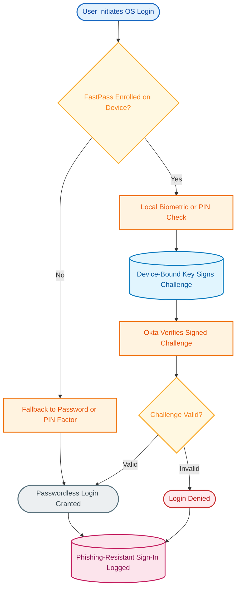
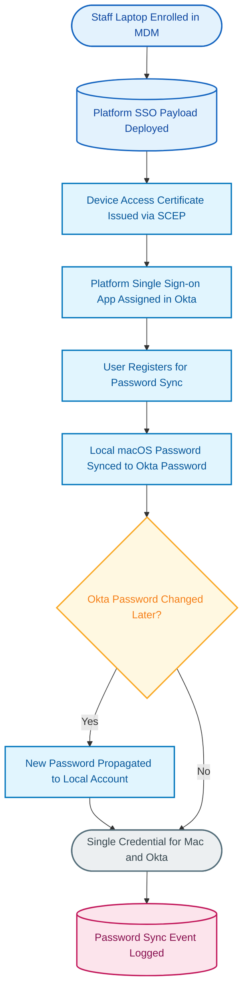

# Okta Device Access: Meridian Health Use Case Implementation Guide

## Executive Summary

Meridian Health is evaluating Okta Device Access to move multi-factor authentication and phishing-resistant login from the application layer down to the actual operating system login prompt on clinical workstations and staff laptops. This guide covers 5 use cases across 5 functional sections: MFA at Windows login for clinical workstations, MFA at macOS login for staff laptops, offline MFA for disconnected or low-connectivity care settings, phishing-resistant login via Okta FastPass, and Desktop Password Sync for a single macOS/Okta credential.

Taken together, these use cases give Meridian Health a consistent identity-driven security posture at the device layer: clinicians and staff prove their identity with the same Okta authenticators already used for application access, but the challenge now happens before the OS session ever unlocks. This is a meaningful step up from directory-only authentication (username/password against Active Directory or Entra ID alone) and directly supports common healthcare compliance drivers — HIPAA safeguards, cyber insurance MFA requirements, and shared-workstation hardening in clinical areas.

This guide is honest about scope as well as capability. Okta Device Access is Windows- and macOS-only (no native Linux path), does not cover Remote Desktop Protocol (RDP) sessions under Desktop MFA, requires a third-party MDM that Meridian Health must already have or acquire, and is licensed as a separate add-on rather than bundled into a standard Workforce Identity Cloud suite. Each section below documents the relevant gaps as discovery items so they can be validated with Meridian Health's IT and clinical engineering teams before a rollout plan is finalized.

---

## Section 1: Desktop MFA at Windows Login for Clinical Workstations

**Use Cases Covered:**
- UC1: Desktop MFA at Windows Login for clinical workstations

### Overview

Clinical workstations — the shared and personally-assigned Windows machines used at nursing stations, exam rooms, and clinical support areas — typically authenticate users against Active Directory or Entra ID alone at the login screen. That means the strength of the login is whatever the domain password policy allows, with no additional factor required until (if ever) the clinician reaches a specific application. For a healthcare organization handling protected health information (PHI), that gap between "logged into Windows" and "authenticated with MFA" is exactly the kind of exposure auditors, cyber insurers, and HIPAA risk assessments flag.

Desktop MFA for Windows closes that gap by inserting an Okta Verify challenge directly into the Windows sign-in flow, before the desktop session unlocks. The workstation must already be Active Directory- or Entra ID-joined — Desktop MFA is an added authentication layer on top of the existing domain join, not a replacement for it. Okta Verify is deployed as a desktop agent via Meridian Health's MDM tooling, and the same Workforce Identity Cloud Sign-On Policy that already governs application MFA is what Desktop MFA enforces at the OS layer.

This is a stronger control than "MFA on the EHR only," because a clinician who steps away from an unlocked, domain-authenticated workstation in a shared clinical area is a common real-world exposure — Desktop MFA extends the same phishing-resistant, push-based experience clinicians already use for Okta-protected apps down to that first login moment.

### How It Works

The flow starts the moment a clinician sits down at a joined workstation and enters domain credentials. Rather than unlocking on a valid password alone, the Okta Verify desktop agent intercepts the login and applies the same WIC Sign-On Policy already governing app access. If the policy requires MFA for this user/group/context, a challenge is issued using whichever online authenticator is enrolled and permitted (push, TOTP, RSA SecurID token, or FIDO2 security key). A denied or timed-out challenge blocks the desktop unlock entirely, and every attempt — successful or not — is captured in the sign-in event log for audit purposes.

### Key Features

| Feature | Purpose |
|---------|---------|
| Desktop MFA for Windows | Enforces Okta MFA at the Windows sign-in screen and lock screen, not just at the application layer, closing the gap between domain login and identity-verified login |
| Okta Verify desktop agent | The client that performs the push/TOTP/FIDO2 challenge at the OS login prompt; deployed via MDM as a packaged installer |
| Shared WIC Sign-On Policy enforcement | Reuses the same policy engine already governing app MFA, so Meridian Health does not need to maintain a parallel policy set for desktop login |
| Desktop MFA recovery PIN | Lets IT issue a time-limited recovery PIN so a locked-out clinician can regain access without a full account reset, minimizing clinical downtime |
| Self-service password reset at the lock screen | Allows a user to reset their Okta password from the Windows lock screen, which then syncs back to AD/Entra ID |

### Discovery Items

- [ ] Which clinical workstations are already Active Directory- or Entra ID-joined today, and are any still workgroup-joined or otherwise ineligible for Desktop MFA?
- [ ] What MDM solution will push the Okta Verify installer and Desktop MFA configuration profile to these workstations, and is it already deployed to the clinical workstation fleet or does it need to be extended there?
- [ ] Is Remote Desktop Protocol (RDP) access to clinical workstations in scope? Desktop MFA for Windows does not cover RDP sessions — confirm whether RDP is used for remote clinical support/EHR access and, if so, scope the separate Okta MFA Credential Provider for Windows or another compensating control.
- [ ] For shared/kiosk-style clinical workstations (e.g., nursing station terminals used by multiple staff per shift), how does Meridian Health want per-user Desktop MFA to map onto a device that isn't tied to one person?
- [ ] Confirm the minimum Windows build on target workstations — Desktop MFA requires Windows 11 or Windows 10 21H2 or later; any workstations on older builds will need an OS upgrade before rollout.

---

## Section 2: Desktop MFA at macOS Login for Staff Laptops

**Use Cases Covered:**
- UC2: Desktop MFA at macOS Login for staff laptops

### Overview

Administrative and clinical support staff at Meridian Health who work from Mac laptops face the same underlying exposure as the Windows clinical workstation fleet: the local macOS login screen authenticates against a local account password, independent of whatever MFA policy Meridian Health enforces for Okta-protected applications. A lost or stolen laptop, or a shoulder-surfed local password, bypasses Okta MFA entirely if the OS login itself isn't in scope.

Desktop MFA for macOS addresses this by linking the user's local macOS account to their Okta identity and enforcing an MFA challenge at the macOS login window, using the same Okta Verify desktop agent and WIC Sign-On Policy model as the Windows use case. Deployment depends on the laptops being enrolled in an MDM solution capable of pushing installer packages and configuration profiles — Okta does not provide device management itself, so this is a hard prerequisite rather than an optional integration.

For Meridian Health, this closes the same audit gap as Section 1 but for the Mac-based portion of the fleet, and it sets up a natural on-ramp to Desktop Password Sync and FastPass at OS login (Sections 4 and 5), both of which build on the same enrolled-device, Okta Verify-based foundation.

### How It Works

The flow mirrors the Windows use case with macOS-specific components: MDM enrollment is the entry condition, the Okta Verify desktop agent links the local macOS account to the staff member's Okta identity, and the same Sign-On Policy is enforced. Verified online authenticators for macOS Desktop MFA are Okta Verify Push, Okta Verify TOTP, and FIDO2 security keys — notably, Windows-only factors like RSA SecurID tokens and Windows Hello do not apply here. A denied challenge blocks the session, and every login attempt is logged for audit purposes, consistent with Section 1.

### Key Features

| Feature | Purpose |
|---------|---------|
| Desktop MFA for macOS | Enforces Okta MFA at the macOS login window, extending the same OS-level control Meridian Health applies to Windows clinical workstations to the Mac laptop fleet |
| Local account-to-Okta identity linking | Ties the macOS local account to the user's Okta identity so the same person-level policy and audit trail applies regardless of platform |
| MDM-deployed configuration profile | Delivers the Okta Verify installer and Desktop MFA configuration via the existing MDM (e.g., Jamf, Intune) rather than manual per-device setup |
| Configurable sign-in attempt limit | Locks the device and requires admin intervention after a defined number of failed attempts, protecting against brute-force attempts at the login window |
| Desktop MFA recovery for macOS | Gives IT a path to issue temporary recovery access without a full account rebuild when a staff member is locked out |

### Discovery Items

- [ ] What MDM (Jamf, Intune, Workspace ONE, or other) currently manages the staff Mac laptop fleet, and does it support pushing installer packages and configuration profiles today?
- [ ] Are there any Mac laptops used by staff that are unmanaged or personally owned (BYOD)? Desktop MFA for macOS requires MDM enrollment — unmanaged devices are out of scope until enrolled.
- [ ] Which online authenticators does Meridian Health want to standardize on for macOS (Push, TOTP, FIDO2 security keys), and does that match what's already enrolled for app-level MFA?
- [ ] What is the target configurable sign-in attempt limit before lockout, and what is the current helpdesk process for handling a locked-out staff laptop outside business hours?
- [ ] Is there executive/clinical leadership population using Mac laptops that will need an expedited recovery path given on-call or after-hours access needs?

---

## Section 3: Offline MFA for Disconnected / Low-Connectivity Scenarios

**Use Cases Covered:**
- UC3: Offline MFA for disconnected / low-connectivity scenarios

### Overview

Meridian Health almost certainly has staff who work in areas where network connectivity is unreliable or absent at the moment of login — mobile clinics, home-health visits, rural satellite locations, or facilities with spotty Wi-Fi in basement or shielded clinical areas. Standard push-based MFA depends on the Okta Verify desktop agent reaching Okta's cloud service in real time; when that path is unavailable, a clinician who needs to unlock a device to chart or review a patient record has no way to authenticate unless an offline path was planned for in advance.

Offline MFA solves this by letting Okta Verify generate a time-based one-time passcode (TOTP) that a user can read and enter locally, with no network round-trip required at the moment of login. Critically, offline enrollment must happen while the device still has connectivity — a user cannot enroll in offline MFA after they've already lost their connection, which makes this a proactive planning exercise rather than a just-in-time fallback.

This use case is explicitly a fallback path, not a parity replacement for the full online experience: offline factors are a narrower set (no push notifications, no RSA SecurID), and any login performed offline is reconciled with Okta once the device reconnects. Meridian Health's rollout plan should treat offline enrollment as a required onboarding step for any user population with predictable connectivity gaps, not an optional add-on discovered after the fact.

### How It Works

The critical branch point in this diagram is the enrollment step at the top: a user must scan a QR code into Okta Verify and generate an offline seed while the device is still connected, well before they ever lose connectivity. Once offline, a login attempt checks network availability — if present, the standard online challenge from Sections 1–2 applies; if absent, the user opens Okta Verify locally, reads the current TOTP code, and enters it at the login prompt. A valid code unlocks the device; an invalid one (after Meridian Health's configured retry limit) triggers a lockout requiring helpdesk escalation. Either way, the sign-in event reconciles with Okta once the device reconnects, preserving the audit trail.

### Key Features

| Feature | Purpose |
|---------|---------|
| Offline OTP via Okta Verify | Generates a locally-readable TOTP code with no network dependency at the moment of login, covering the disconnected-clinician scenario |
| Pre-connectivity enrollment (QR code) | Forces offline enrollment to happen while online, preventing the common failure mode of a user discovering they can't authenticate only after they've lost connectivity |
| Windows Hello as an offline factor (Windows only) | Lets Windows devices use local biometrics offline in addition to TOTP, reducing reliance on manually-read codes for that platform |
| Reconciliation on reconnect | Ensures offline sign-in events are captured in Okta's audit trail once the device is back online, preserving compliance visibility even for disconnected use |
| Desktop MFA recovery PIN | Provides an escalation path when a user can't produce a valid offline factor at all (e.g., lost phone, uninstalled Okta Verify) |

### Discovery Items

- [ ] Which specific staff populations regularly work without reliable connectivity (mobile clinics, home-health visits, rural satellite sites), and can Meridian Health identify them before rollout to prioritize offline enrollment?
- [ ] Is offline enrollment being built into new-hire and new-device onboarding for these populations, given that it cannot be completed after the device goes offline?
- [ ] Does Meridian Health's compliance/security policy require a code-based OTP specifically, or is Windows Hello biometric offline authentication (Windows devices only) an acceptable alternative for reducing manual code entry?
- [ ] What is the helpdesk process today for a clinician locked out while offline — is there a documented escalation path that doesn't assume the caller has connectivity to resolve the issue?
- [ ] For macOS specifically, confirm Okta Verify TOTP is the only supported offline factor (no offline security key or biometric fallback on macOS) — does that change the plan for any Mac-based offline-work populations?

---

## Section 4: Phishing-Resistant Login with Okta FastPass

**Use Cases Covered:**
- UC4: Phishing-Resistant Login with Okta FastPass

### Overview

Push-based and code-based MFA are a major improvement over password-only login, but both remain vulnerable to real-time phishing and MFA fatigue attacks — a user can still be socially engineered into approving a push notification or entering a code into an attacker-controlled page. For a healthcare organization, where credential-based attacks are a leading cause of PHI breaches, closing that gap at the device login prompt (not just at the app/browser layer) is a meaningful security upgrade.

Okta FastPass at OS login provides that upgrade. It uses a device-bound cryptographic key, unlocked by a local biometric or PIN check (Windows Hello on Windows, Touch ID on macOS), to sign the authentication challenge — there is no shared secret, code, or push approval an attacker can intercept or trick a user into approving. Because the private key never leaves the device and the check is bound to the specific endpoint, this satisfies phishing-resistant authentication in a way that push and TOTP do not.

For Meridian Health, FastPass at OS login is the strongest available login control in the Device Access portfolio, but hardware dependency is real: it requires devices capable of Windows Hello or Touch ID (biometric sensor and, on Windows, typically a TPM), and virtual desktop (VDI) support is newer and more constrained than on physical hardware. This section's discovery items are aimed at scoping exactly where in the fleet FastPass is realistically deployable today versus where a fallback factor is still required.

### How It Works

The decision that matters most in this flow is enrollment status: a device without FastPass enrolled falls back to whatever password or PIN factor is configured (not shown as a separate MFA challenge, since the fallback is out of scope for this section). On an enrolled device, the local biometric or PIN check is purely a user-verification gate — the actual authentication is the device-bound key signing the challenge, which Okta then verifies cryptographically. A valid signature grants passwordless login; an invalid or failed challenge is denied, and every attempt is logged as a phishing-resistant sign-in event distinct from standard push/TOTP logs.

### Key Features

| Feature | Purpose |
|---------|---------|
| Okta FastPass at OS login | Provides phishing-resistant, passwordless authentication at the device login screen using a device-bound key, not a shared secret or push approval |
| Windows Hello / Touch ID user verification | Uses the device's native biometric or PIN check as the local user-verification step, avoiding a separate hardware token |
| Device-bound cryptographic key | The private key never leaves the device, which is what makes the factor resistant to real-time phishing and credential replay |
| Okta Verify Passcode (VDI) | An eight-digit passcode-based alternative to Windows Hello for FastPass user verification in virtual Windows environments that lack biometric hardware |
| Persistent and layered VDI support | Extends FastPass to static and profile-roaming virtual desktops; non-persistent VDIs (fully wiped between sessions) are explicitly not supported |

### Discovery Items

- [ ] What percentage of the target clinical workstation and staff laptop fleet has the hardware to support Windows Hello or Touch ID (biometric sensor, and on Windows typically a TPM)? Devices without this hardware need a documented fallback factor.
- [ ] Is the goal full passwordless login across the fleet, or FastPass as one option alongside a password/PIN fallback for devices that can't support it?
- [ ] Are there VDI or virtual Windows desktop users in scope (e.g., remote clinical access via Citrix or similar)? If so, confirm whether those VDIs are persistent, layered, or non-persistent — FastPass does not support non-persistent VDI at all.
- [ ] What is the enrollment/re-enrollment process when a clinician or staff member is issued a new device, to avoid a gap in phishing-resistant coverage during device refresh cycles?
- [ ] Does Meridian Health's compliance or cyber-insurance documentation require this control to be specifically documented as "phishing-resistant MFA" (a distinct designation from generic MFA), and does the FastPass audit trail satisfy that reporting requirement as-is?

---

## Section 5: Desktop Password Sync

**Use Cases Covered:**
- UC5: Desktop Password Sync

### Overview

Staff who use Mac laptops today likely manage two separate passwords: the local macOS account password and their Okta password, which drift out of sync over time and drive a predictable stream of helpdesk password-reset tickets for "the other one" whenever a user only remembers to update one. That dual-password friction is a real, quantifiable cost, distinct from the MFA use cases in Sections 1–2 and 4.

Desktop Password Sync resolves this by building on Apple's native Platform SSO framework (not a custom Okta agent workaround) to synchronize the local macOS account password with the user's Okta password. Once registered, a password change or rotation in Okta propagates to the local account automatically, giving staff a single credential to remember and reducing password-related helpdesk volume.

This is explicitly a macOS-only capability with a hard OS floor: it requires macOS 14 Sonoma or later, since it depends on Apple's Platform SSO. It is also a natural stepping stone toward the fuller passwordless experience in Section 4 — the same enrollment flow that sets up Desktop Password Sync commonly enrolls the user in FastPass at the same time. Meridian Health should treat this as a quality-of-life and helpdesk-cost improvement first, with phishing-resistant login as the longer-term destination for the same device population.

### How It Works

The setup steps at the top of this diagram — MDM enrollment, the Platform SSO payload, the Device Access SCEP certificate, and the Platform Single Sign-on app assignment in Okta — are all one-time prerequisites Meridian Health completes before any user registers. Once a staff member registers, their local macOS password is synchronized with their Okta password immediately. From then on, any Okta password change (self-service or forced rotation) propagates automatically to the local account, so the user never has to separately update the Mac login password; every sync event is logged for audit purposes.

### Key Features

| Feature | Purpose |
|---------|---------|
| Desktop Password Sync | Synchronizes the local macOS account password with the Okta password, eliminating a separate credential for staff to manage |
| Apple Platform SSO foundation | Built on Apple's native macOS framework rather than a custom Okta agent, which reduces the support burden and keeps the mechanism aligned with Apple's own security model |
| Device Access certificate (SCEP) | Required device-identity certificate for Desktop Password Sync on macOS 14 (Sonoma) and later, issued and managed separately from device assurance/trust certificates |
| Automatic password propagation | Pushes future Okta password changes down to the local account without user action, keeping the two credentials from drifting apart again |
| Shared enrollment path with FastPass | The same registration flow can enroll the user in FastPass at the same time, giving Meridian Health a natural path from password sync to full passwordless login |

### Discovery Items

- [ ] Is the staff Mac laptop fleet on macOS 14 Sonoma or later? Desktop Password Sync has a hard OS floor via Apple Platform SSO — older Macs cannot use it regardless of Okta licensing.
- [ ] Has macOS local password expiration been disabled at the MDM level, as required before deploying Desktop Password Sync? (Okta's own configuration guidance calls this out as a prerequisite step.)
- [ ] Are there staff members with multiple local accounts on one Mac, or shared devices? Desktop Password Sync registers one Okta account per device — a second local account under the same or a different Okta identity is a scenario to explicitly plan for, since Okta's documentation notes it may require a factory reset to reassign.
- [ ] Is this being scoped as a standalone helpdesk-cost reduction, or as a deliberate stepping stone toward the FastPass passwordless experience in Section 4 for the same device population?
- [ ] Confirm this is explicitly out of scope for the Windows clinical workstation fleet — Desktop Password Sync as documented by Okta is macOS-specific, so any Windows password-sync expectation needs to be scoped as a separate conversation.

---

## Appendix A: Use Case to Section Mapping

| Use Case | Name | Section |
|----------|------|---------|
| UC1 | Desktop MFA at Windows Login for clinical workstations | Section 1: Desktop MFA at Windows Login for Clinical Workstations |
| UC2 | Desktop MFA at macOS Login for staff laptops | Section 2: Desktop MFA at macOS Login for Staff Laptops |
| UC3 | Offline MFA for disconnected / low-connectivity scenarios | Section 3: Offline MFA for Disconnected / Low-Connectivity Scenarios |
| UC4 | Phishing-Resistant Login with Okta FastPass | Section 4: Phishing-Resistant Login with Okta FastPass |
| UC5 | Desktop Password Sync | Section 5: Desktop Password Sync |

## Appendix B: Key Components Used

| Component | Purpose | Sections Used |
|-----------|---------|---------------|
| Okta Verify (desktop agent) | Client agent installed on Windows/macOS devices that performs push, TOTP, offline, and FastPass challenges at OS login | 1, 2, 3, 4 |
| Desktop MFA for Windows | Enforces Okta MFA at the Windows sign-in and lock screen | 1 |
| Desktop MFA for macOS | Enforces Okta MFA at the macOS login window | 2 |
| WIC Sign-On Policy / Authenticators | Underlying Workforce Identity Cloud policy engine defining allowed factors, enforced at the OS layer by Desktop MFA | 1, 2 |
| Active Directory / Microsoft Entra ID | Directory join required before Desktop MFA for Windows can be deployed | 1 |
| MDM (Jamf, Microsoft Intune, Workspace ONE, or equivalent) | Required third-party tool for deploying the Okta Verify installer, configuration profiles, and Platform SSO payload; Okta does not provide device management | 1, 2, 3, 4, 5 |
| Offline MFA / Offline OTP | Okta Verify-generated TOTP usable with no network connectivity, enrolled in advance while online | 3 |
| Okta FastPass at OS login | Phishing-resistant, passwordless authentication at the device login screen using a device-bound key and local biometric/PIN | 4 |
| Okta Verify Passcode | Passcode-based FastPass user-verification alternative for virtual Windows environments without Windows Hello | 4 |
| Desktop Password Sync | Synchronizes the local macOS account password with the Okta password via Apple Platform SSO | 5 |
| Apple Platform SSO | Apple's native macOS framework underlying Desktop Password Sync (macOS 14 Sonoma+) | 5 |
| Device Access certificates (SCEP) | Certificates deployed via MDM/SCEP that establish device identity for Device Access, required for Desktop Password Sync; explicitly distinct from device assurance certificates | 5 |
| Desktop MFA recovery PIN | Time-limited admin-issued PIN for regaining access to a locked-out device | 1, 2, 3 |

## Appendix C: Discovery Items Summary

**Section 1: Desktop MFA at Windows Login for Clinical Workstations**
- [ ] Which clinical workstations are already Active Directory- or Entra ID-joined today, and are any still workgroup-joined or otherwise ineligible for Desktop MFA?
- [ ] What MDM solution will push the Okta Verify installer and Desktop MFA configuration profile to these workstations, and is it already deployed to the clinical workstation fleet or does it need to be extended there?
- [ ] Is Remote Desktop Protocol (RDP) access to clinical workstations in scope? Desktop MFA for Windows does not cover RDP sessions — confirm whether RDP is used for remote clinical support/EHR access and, if so, scope the separate Okta MFA Credential Provider for Windows or another compensating control.
- [ ] For shared/kiosk-style clinical workstations (e.g., nursing station terminals used by multiple staff per shift), how does Meridian Health want per-user Desktop MFA to map onto a device that isn't tied to one person?
- [ ] Confirm the minimum Windows build on target workstations — Desktop MFA requires Windows 11 or Windows 10 21H2 or later; any workstations on older builds will need an OS upgrade before rollout.

**Section 2: Desktop MFA at macOS Login for Staff Laptops**
- [ ] What MDM (Jamf, Intune, Workspace ONE, or other) currently manages the staff Mac laptop fleet, and does it support pushing installer packages and configuration profiles today?
- [ ] Are there any Mac laptops used by staff that are unmanaged or personally owned (BYOD)? Desktop MFA for macOS requires MDM enrollment — unmanaged devices are out of scope until enrolled.
- [ ] Which online authenticators does Meridian Health want to standardize on for macOS (Push, TOTP, FIDO2 security keys), and does that match what's already enrolled for app-level MFA?
- [ ] What is the target configurable sign-in attempt limit before lockout, and what is the current helpdesk process for handling a locked-out staff laptop outside business hours?
- [ ] Is there executive/clinical leadership population using Mac laptops that will need an expedited recovery path given on-call or after-hours access needs?

**Section 3: Offline MFA for Disconnected / Low-Connectivity Scenarios**
- [ ] Which specific staff populations regularly work without reliable connectivity (mobile clinics, home-health visits, rural satellite sites), and can Meridian Health identify them before rollout to prioritize offline enrollment?
- [ ] Is offline enrollment being built into new-hire and new-device onboarding for these populations, given that it cannot be completed after the device goes offline?
- [ ] Does Meridian Health's compliance/security policy require a code-based OTP specifically, or is Windows Hello biometric offline authentication (Windows devices only) an acceptable alternative for reducing manual code entry?
- [ ] What is the helpdesk process today for a clinician locked out while offline — is there a documented escalation path that doesn't assume the caller has connectivity to resolve the issue?
- [ ] For macOS specifically, confirm Okta Verify TOTP is the only supported offline factor (no offline security key or biometric fallback on macOS) — does that change the plan for any Mac-based offline-work populations?

**Section 4: Phishing-Resistant Login with Okta FastPass**
- [ ] What percentage of the target clinical workstation and staff laptop fleet has the hardware to support Windows Hello or Touch ID (biometric sensor, and on Windows typically a TPM)? Devices without this hardware need a documented fallback factor.
- [ ] Is the goal full passwordless login across the fleet, or FastPass as one option alongside a password/PIN fallback for devices that can't support it?
- [ ] Are there VDI or virtual Windows desktop users in scope (e.g., remote clinical access via Citrix or similar)? If so, confirm whether those VDIs are persistent, layered, or non-persistent — FastPass does not support non-persistent VDI at all.
- [ ] What is the enrollment/re-enrollment process when a clinician or staff member is issued a new device, to avoid a gap in phishing-resistant coverage during device refresh cycles?
- [ ] Does Meridian Health's compliance or cyber-insurance documentation require this control to be specifically documented as "phishing-resistant MFA" (a distinct designation from generic MFA), and does the FastPass audit trail satisfy that reporting requirement as-is?

**Section 5: Desktop Password Sync**
- [ ] Is the staff Mac laptop fleet on macOS 14 Sonoma or later? Desktop Password Sync has a hard OS floor via Apple Platform SSO — older Macs cannot use it regardless of Okta licensing.
- [ ] Has macOS local password expiration been disabled at the MDM level, as required before deploying Desktop Password Sync?
- [ ] Are there staff members with multiple local accounts on one Mac, or shared devices? Desktop Password Sync registers one Okta account per device, and reassigning a second account may require a factory reset.
- [ ] Is this being scoped as a standalone helpdesk-cost reduction, or as a deliberate stepping stone toward the FastPass passwordless experience in Section 4 for the same device population?
- [ ] Confirm this is explicitly out of scope for the Windows clinical workstation fleet — Desktop Password Sync as documented by Okta is macOS-specific.

---

## Appendix D: Cross-Cutting Gaps and Licensing Notes

These apply across all five use cases and were validated against current Okta documentation during preparation of this guide (July 2026):

- **No Linux support**: Desktop MFA, Desktop Password Sync, and FastPass at OS login are Windows and macOS only. Any Linux clinical or lab workstations need a separate, non-Okta-native answer.
- **No RDP support under Desktop MFA**: Desktop MFA for Windows explicitly does not cover Remote Desktop Protocol sessions. A separate, older Okta product — the Okta MFA Credential Provider for Windows — does support MFA for RDP sessions to domain-joined Windows computers and servers, but it is a distinct capability from Device Access and does not support FIDO2/WebAuthn or smart card authenticators. If RDP-based clinical or IT support access is common at Meridian Health, this needs to be scoped as its own conversation rather than assumed to be covered by Desktop MFA.
- **MDM is a hard prerequisite**: Okta does not provide its own device management. Every use case in this guide depends on Meridian Health already having (or acquiring) an MDM — Jamf, Microsoft Intune, and Workspace ONE are the platforms Okta documents configuration guidance for; other MDMs may work via a generic MDM path but should be validated.
- **Licensing is a separate add-on**: Device Access is listed as an individually-purchasable item in Okta's itemized product catalog, not a feature automatically bundled into a Workforce Identity Cloud suite. Confirm Meridian Health's contract includes it before scoping a rollout.
- **Compliance environment note**: Okta documents Device Access as authorized for use in Okta for Government Moderate (FedRAMP Moderate), Okta for Government High (FedRAMP High), and Okta for US Military environments. If Meridian Health has any Okta for Government tenancy considerations, validate Device Access availability against the specific environment in use.
