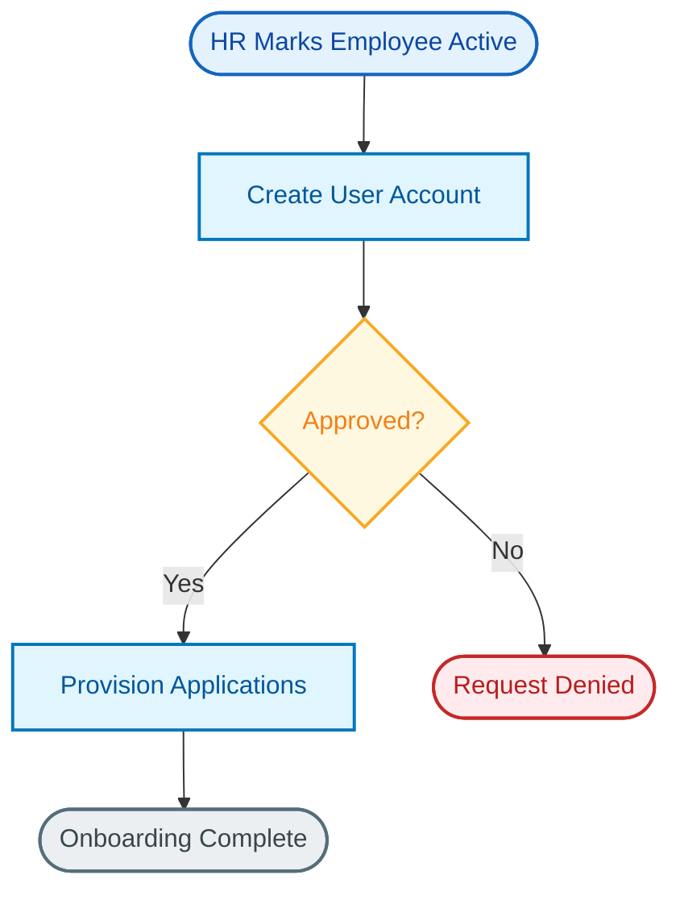

# Mermaid Diagram Standards

## Flowchart Declaration

Always use `flowchart TD` (top-down) for main process flows.

## Node Shapes

| Shape | Syntax | Use For |
|-------|--------|---------|
| Rounded rectangle | `([text])` | Start / end points, triggers, external events |
| Rectangle | `[text]` | Actions, process steps |
| Diamond | `{text}` | Decision points, conditions |
| Cylinder | `[(text)]` | Databases, logs, storage |

## Syntax Rules (CRITICAL)

These rules are non-negotiable. Violating them will break diagram rendering.

### Line Breaks

Mermaid's accepted line-break syntax has changed across versions. As of mermaid v10+, `<br>` and `<br/>` are both generally accepted in node text, but behavior depends on the `htmlLabels` config setting and may differ between v10.x and v11.x.

**Rule:** If a node needs a line break, render-test the diagram against the current mermaid version pinned in `document-template.md` before relying on the syntax. Do not hardcode either form as "always correct" — test it.

The test harness in `tests/test_mermaid_validator.py` includes a render check that catches line-break failures empirically.

### Bullets in Nodes

- Use `-` (hyphen) for bullet points
- NEVER use `•` (bullet character — breaks parsing)

### Quotes

- Avoid single quotes in node text entirely
- For subgraph labels with special characters, use: `subgraph Name["Display Label"]`

### Subgraphs

Every `subgraph` MUST have a matching `end`:

```
subgraph GroupName["Label"]
    direction LR
    Node1[Step 1]
    Node2[Step 2]
end
```

### Arrow Labels

```
A -->|Yes| B
A -->|No| C
A -->|Condition Text| D
```

### Class Definitions

Always include `classDef` AND class assignments. Never define a class without using it, never use a class without defining it. The validator in `quality-checklist.md` enforces this.

---

## Color Palette

Use these exact color definitions for professional, consistent diagrams:

```
classDef trigger fill:#e3f2fd,stroke:#1565c0,stroke-width:2px,color:#0d47a1
classDef extSystem fill:#e3f2fd,stroke:#1565c0,stroke-width:2px,color:#0d47a1
classDef platform fill:#fff3e0,stroke:#ef6c00,stroke-width:2px,color:#e65100
classDef workflow fill:#f3e5f5,stroke:#7b1fa2,stroke-width:2px,color:#4a148c
classDef decision fill:#fff8e1,stroke:#f9a825,stroke-width:2px,color:#f57f17
classDef governance fill:#e8f5e9,stroke:#2e7d32,stroke-width:2px,color:#1b5e20
classDef action fill:#e1f5fe,stroke:#0277bd,stroke-width:2px,color:#01579b
classDef endpoint fill:#eceff1,stroke:#546e7a,stroke-width:2px,color:#37474f
classDef danger fill:#ffebee,stroke:#c62828,stroke-width:2px,color:#b71c1c
classDef audit fill:#fce4ec,stroke:#c2185b,stroke-width:2px,color:#880e4f
classDef notify fill:#fff3e0,stroke:#ff6f00,stroke-width:2px,color:#e65100
```

### When to Use Each Color

| Class | Purpose | Examples |
|-------|---------|----------|
| `trigger` | External events that start a flow | HR system event, scheduled task, user action |
| `extSystem` | External systems interacting with the platform | HRIS, AD, LDAP, SCIM targets |
| `platform` | Core platform processing | Identity engine, profile mastering |
| `workflow` | Automation / workflow engine steps | Okta Workflows, automation rules |
| `decision` | Conditional branching | Approval checks, policy evaluation |
| `governance` | Group rules, governance policies | Access certifications, SoD checks |
| `action` | Provisioning and assignment actions | App assignment, group membership |
| `endpoint` | Terminal states, completion | Process complete, account active |
| `danger` | Denied, revoked, error states | Access denied, account disabled |
| `audit` | Logging and compliance events | Audit log entry, compliance report |
| `notify` | Notifications | Email alerts, Slack messages |

---

## Overlap Prevention (CRITICAL)

Overlapping lines make diagrams unreadable. Follow these patterns.

### Problem: Fan-in (multiple sources → one target)

```
BAD - Lines will overlap:
A --> C
B --> C

GOOD - Use subgraph to group sources:
subgraph Sources["Input"]
    direction LR
    A[Source A]
    B[Source B]
end
Sources --> C
```

### Problem: Fan-out then fan-in (diamond with merge)

```
BAD - Creates crossing lines:
Decision{Check?}
Decision -->|Yes| PathA
Decision -->|No| PathB
PathA --> Result
PathB --> Result

GOOD - Collapse parallel processing:
Decision{Check?}
Decision --> Process[Handle Both Cases]
Process --> Result
```

### Problem: Multiple decisions pointing to same error

```
BAD - Lines cross:
Validate{Valid?} -->|No| Error
Save{Saved?} -->|No| Error

GOOD - Collapse into single decision:
Process[Validate and Save]
Result{Success?}
Process --> Result
Result -->|Yes| Done
Result -->|No| Error
```

### General Principles

1. **One path in, one path out** for each logical group
2. **Collapse parallel paths** that merge to the same destination
3. **Use `direction LR` or `direction TB`** inside subgraphs to control layout
4. **Avoid decisions that both branch to AND merge from** the same nodes
5. **Keep diagrams linear** — vertical flow with minimal branching
6. **Max 12–15 nodes per diagram** — split complex flows into multiple diagrams

---

## Complete Example



---

## Common Patterns

### Approval Flow

```
Request([User Requests Access])
Evaluate[Evaluate Policy]
Approve{Manager Approves?}
Grant[Grant Access]
Deny([Access Denied])
Log[(Audit Log)]

Request --> Evaluate --> Approve
Approve -->|Yes| Grant --> Log
Approve -->|No| Deny --> Log
```

### Scheduled Task

```
Trigger([Scheduled Task Runs])
Scan[Scan for Changes]
Found{Changes Found?}
Process[Process Changes]
Complete([Task Complete])

Trigger --> Scan --> Found
Found -->|Yes| Process --> Complete
Found -->|No| Complete
```

### Lifecycle Event (Joiner / Mover / Leaver)

```
Event([HR Event Detected])
Match[Match Identity]
Rules[Evaluate Group Rules]
Assign[Assign Applications]
Notify[Send Notifications]
Done([Process Complete])

Event --> Match --> Rules --> Assign --> Notify --> Done
```
